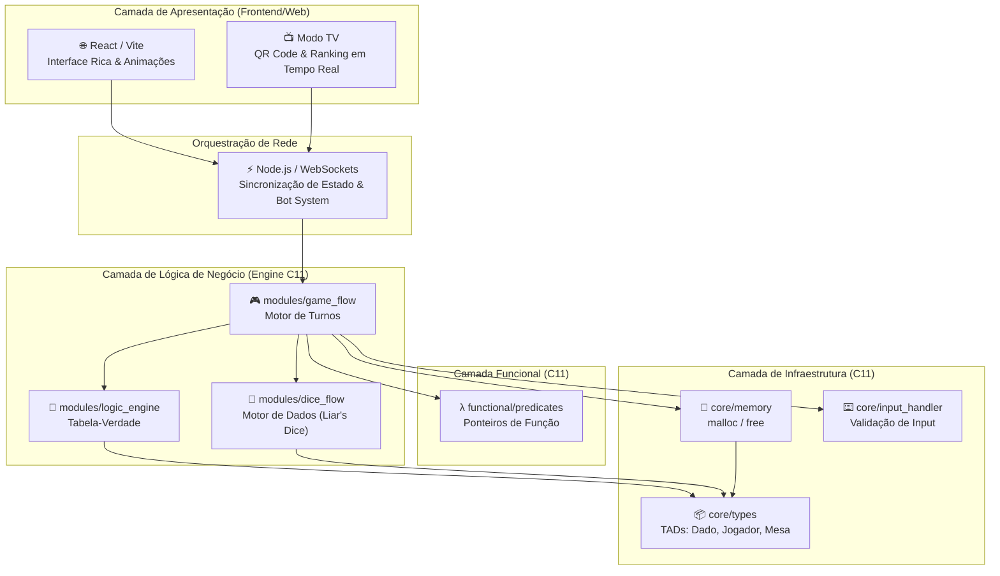
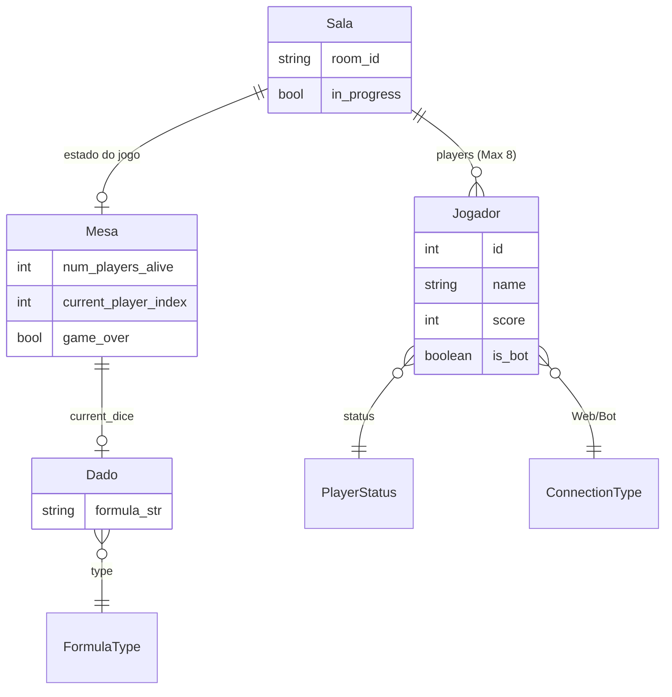
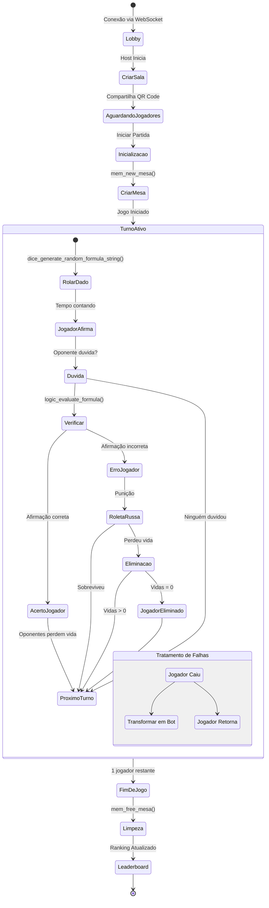
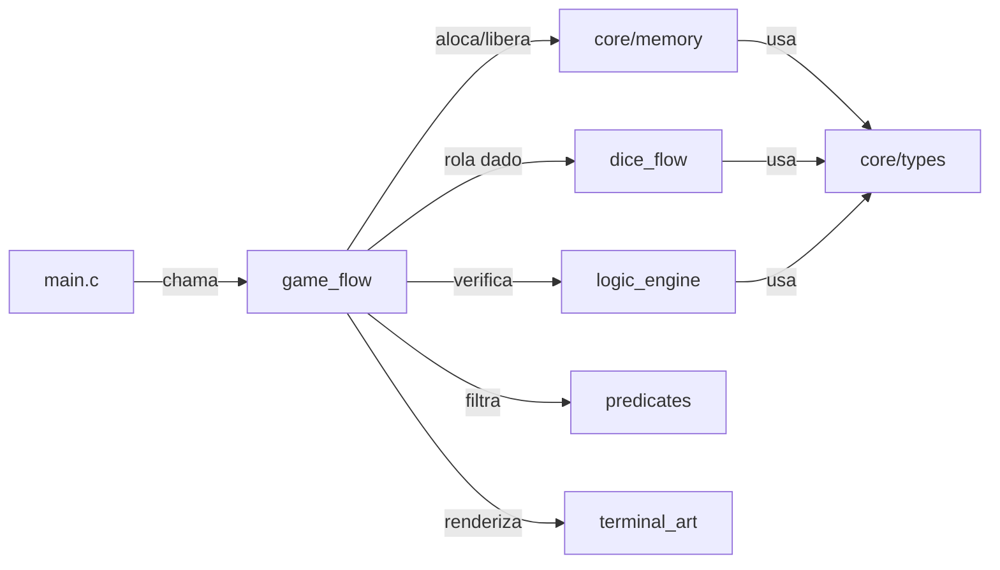

# 🥃 The Boolean Bar
<p align="center"><em>Enterprise-Grade Logic Game Engine & Web Platform</em></p>
<p align="center"><em>Onde a única verdade absoluta é a sua sobrevivência em tempo real.</em></p>

<p align="center">
  
</p>

<p align="center">
  
  
  
  
  
  
</p>

<p align="center">
  <a href="https://rsc3-boolean.duckdns.org/" target="_blank">
    
  </a>
</p>

<p align="center">
  🌐 <strong>Plataforma Web (Produção):</strong> <a href="https://rsc3-boolean.duckdns.org/" target="_blank">rsc3-boolean.duckdns.org</a><br/>
  📺 <strong>Experiência de Transmissão (Modo TV):</strong> <a href="https://rsc3-boolean.duckdns.org/tv" target="_blank">rsc3-boolean.duckdns.org/tv</a>
</p>

---

## 🎮 Gameplay (Screencast)

<p align="center">
  <video src="https://luvaplay.com.br/game/Screencast.mp4" controls width="800"></video>
</p>

<p align="center">
  ▶️ Se o vídeo não carregar inline, <strong><a href="https://luvaplay.com.br/game/Screencast.mp4" target="_blank">clique aqui para assistir ao screencast</a></strong>.
</p>

---

## 🎯 Sobre o Projeto

**The Boolean Bar** é um ecossistema fullstack e simulador de mesa de apostas clandestina onde a moeda de troca é o raciocínio lógico. Desenvolvido com padrões de arquitetura de alto nível, o jogo desafia até 8 jogadores a validarem fórmulas de lógica proposicional sob pressão, onde um erro técnico leva diretamente à Roleta Russa.

Concebido originalmente como um **Projeto Integrador (PI)** de excelência, unindo os conhecimentos das cadeiras de **Programação Imperativa e Funcional (PIF)**, **Lógica para Computação**, **Fundamentos de Desenvolvimento de Software (FDS)** e **Interface Humano Computador (IHC)** no CESAR School. A plataforma evoluiu de um motor em C para um ecossistema fullstack completo.

---

## 🔥 Modos de Jogo & Dinâmica

O ecossistema suporta dois modos principais de jogo multiplayer online (com suporte a bots):

### 1. 🥃 Modo Lógica (Boolean Bar)
Neste modo, os jogadores utilizam **cartas** contendo fórmulas da lógica proposicional clássica (ex: `P ∧ ¬P`, `P ∨ Q`, `P → Q`). No seu turno, o jogador deve baixar uma carta e afirmar se a fórmula correspondente é uma **Tautologia**, **Contradição** ou **Contingência** (podendo mentir/blefar).

* O oponente da vez decide se vai **Acreditar** ou **Duvidar** da afirmação.
* Se duvidar, a fórmula é enviada à *Engine lógica em C* para avaliação automática via tabela-verdade.
* Quem perder o confronto (por mentir ou por duvidar erroneamente) é punido na **Roleta Russa** da mesa, puxando o gatilho do revólver.
* A roleta inicia com 1 bala em 6 câmaras. A cada clique seco (sobrevivência), mais uma bala é adicionada, aumentando exponencialmente o perigo. Perder todas as 3 vidas resulta em eliminação. O último jogador vivo vence.

```text
┌─────────────────────────────────────────────────────────────┐
│ Carta Baixada: (P ∧ ¬P)                                     │
│ Afirmação do Jogador: "Isso é uma Tautologia!"              │
│                                                             │
│ 🚨 OPONENTE DUVIDA!                                         │
│                                                             │
│ Verificação (Engine C): (P ∧ ¬P) é uma CONTRADIÇÃO.         │
│ Consequência: Blefador puxa o gatilho da Roleta Russa.      │
└─────────────────────────────────────────────────────────────┘
```

### 🎲 2. Modo Dados (Liar's Dice)
Uma implementação fiel do clássico jogo de apostas e blefes. Cada jogador começa com **3 dados** escondidos em seu copo individual. O jogador conhece apenas os seus próprios dados e deve fazer uma aposta sobre a quantidade total de dados com uma determinada face (de 1 a 6) que estão na mesa (somando os dados de todos os jogadores).

* A aposta seguinte deve sempre **subir** a anterior: ou aumentando a quantidade de dados, ou mantendo a quantidade e aumentando a face do dado.
* Um jogador pode escolher **Duvidar** da aposta anterior se achar que o total real de dados na mesa é inferior ao apostado.
* Em caso de dúvida, todos os copos são abertos e as faces são reveladas.
* Se a aposta for verdadeira (o total real for maior ou igual ao apostado), o duvidador perde 1 dado. Se a aposta for um blefe (o total real for menor), o apostador perde 1 dado.
* Ficar com 0 dados elimina o jogador. Não há regra de curingas (o valor '1' é uma face normal). O último a restar com dados vence a partida.

---

## ✨ Funcionalidades do Épico (The Boolean Bar v2.0)

As funcionalidades unem os requisitos rigorosos das linguagens base com necessidades modernas de sistemas distribuídos:

1.  **Inicializar Ambiente**: Alocação de memória determinística para gerenciar a mesa no core em C.
2.  **Gerar Proposições**: Composição aleatória de fórmulas lógicas e variáveis respeitando integridade sintática.
3.  **Avaliar Veracidade**: Computação do valor de verdade via Tabela-Verdade automatizada para validar os blefes.
4.  **Executar "Duvidar"**: Confronto matemático de premissas com a tabela da verdade, disparando punições.
5.  **Operar Roleta**: Sorteio probabilístico para verificar fatalidade baseada nas câmaras da arma.
6.  **Filtrar Sobreviventes**: Varredura via Ponteiros de Função no paradigma funcional (C).
7.  **Sincronizar Estados (WebSockets)**: Orquestração de turnos em tempo real com baixa latência entre clientes distribuídos.
8.  **Experiência de Transmissão (Modo TV)**: Interface visual dedicada em telas grandes com pareamento dinâmico via QR Code e ranking global dinâmico.
9.  **Resiliência via Bot System**: Transição automática de jogadores desconectados para IAs lógicas (bots), evitando a queda da partida.
10. **Persistência de Sessão e Reconexão**: Gerenciamento de tokens e estados isolados para que falhas de rede de até 60s não interfiram no andamento do jogo.
11. **Ambiente Sonoro Imersivo (Web Audio API)**: Música de cassino em loop em segundo plano e efeitos sonoros gerados por síntese de áudio via osciladores em tempo real (beeps de turno, tom de aposta, acordes de dúvida, ticks da roleta, cliques mecânicos e disparo sintetizado), sem arquivos externos, em conformidade com as regras de interação do browser.
12. **Interface Neon & UX Avançada**: Animações de pulso neon (*heartbeat*) no menu, crossfade suave de 250ms nas transições entre páginas e indicadores de turno em flash (verde/cyan).
13. **Chat de Mesa & Emojis**: Sistema de comunicação de baixa latência contendo emojis flutuantes dinâmicos e whitelist de falas curtas com controle inteligente de spam.
14. **Modo Espectador**: Jogadores eliminados permanecem na sala em tempo real como espectadores e podem torcer/interagir enviando emojis e chat.
15. **Sistema de Contadores (Streaks)**: Avisos visuais em tela ("STREAK x2!") para jogadas bem-sucedidas em sequência na mesa, promovendo competitividade.

---

## 🏗️ Arquitetura Híbrida Enterprise (Monorepo)

O projeto adota uma estrutura de **Monorepo**, segregando as responsabilidades de processamento crítico (Engine em C) da interface iterativa de tempo real (Web/Node).

### Estrutura de Diretórios

```text
The-Boolean-Bar/
├── engine/                      # 🧠 Game Engine Core (C11)
│   ├── main.c                   # Entry point (modo Lógica ou Dados)
│   ├── core/                    # TADs (types.h), memória e input handler
│   ├── modules/                 # game_flow, dice_flow, logic_engine, deck_manager
│   ├── functional/              # predicates.c (Ponteiros de Função)
│   └── ui/                      # terminal_art.c (ASCII Art + cores ANSI)
├── web/                         # 🌐 Web Platform (React + Vite + Node)
│   ├── src/                     # UI Rica, Hooks e Componentes (Tailwind)
│   ├── web_server.js            # Gateway de WebSockets e Lobby online
│   ├── test_rooms.js            # Smoke test do servidor (npm test)
│   └── stress_test.js           # Teste de carga, 100+ sessões (npm run stress)
├── docs/                        # 📄 Documentos de ADR, Lógica e Manuais
├── assets/                      # 🖼️ Assets estáticos e multimídia
├── scripts/                     # 🛠️ Automações (PS1) de pós-build
├── build/                       # ⚙️ Binário compilado (gerado, fora do git)
├── Makefile                     # 🚀 Orquestrador Master (cross-platform)
└── README.md                    # Manifesto do Sistema
```

### Decisões Arquiteturais (Senior Level)

-   **Physical Separation of Concerns**: O core engine em C nunca se "mistura" com as renderizações do frontend, permitindo escalabilidade e testabilidade independentes.
-   **Tolerância a Falhas**: A introdução do WebSocket Gateway permite que clientes que percam conexão sejam assumidos instantaneamente por bots, sem travar a engine central.
-   **Header Namespacing (C)**: Uso de `#include "core/memory.h"` para prevenir colisões de nomenclaturas globais.
-   **Out-of-Source Build**: Artefatos não "sujam" a árvore de diretórios, todos isolados em `build/` e `bin/`.

---

## 🛠️ Tech Stack & Conceitos Aplicados

| Camada         | Tecnologia / Conceito         | Justificativa                                        |
| :------------- | :---------------------------- | :--------------------------------------------------- |
| **Linguagem Core**| C (Padrão C11)                | Controle absoluto de memória, exigência de PIF.      |
| **Rede/Backend**  | Node.js + WebSockets (ws)     | Sincronização full-duplex de estado em tempo real.   |
| **Frontend UI**   | React 19 + TypeScript + Vite  | Reatividade, componentes componíveis e tipagem.      |
| **Memória**       | Alocação Dinâmica             | Gestão estrita via `malloc` / `free` na engine.      |
| **Paradigma**     | Imperativo/Funcional          | Controle de fluxo direto + Ponteiros de função.      |
| **Lógica**        | Cálculo Proposicional         | A própria regra de negócio é a avaliação de fórmulas.|

---

## 📊 Diagramas Técnicos

### Arquitetura em Camadas (Híbrida)



### Modelo de Dados (Entidade-Relacionamento)



### Fluxo do Jogo (Máquina de Estados)



### Dependência Interna da Engine (C)


---

## 🛠️ Build System & Execução

Para rodar todo o ecossistema localmente, siga estes dois passos:

### 1. Compilar a Engine Base (Motor Lógico)
Necessita de GCC (Linux/Windows MSYS2) e Make instalados. Na raiz do projeto:
```bash
make
```
Isso gera o binário em `build/boolean_bar` (Linux) ou `build\boolean_bar.exe` (Windows).
*Opcional: testar direto no terminal com `make run` (escolhe o modo) ou `make run-logic` / `make run-dice`.*

### 2. Rodar a Plataforma Web e Servidor Online
Em um novo terminal, abra a pasta da interface web:
```bash
cd web
npm install
# Inicia o servidor de WebSockets + o Frontend do Vite:
node web_server.js
```
*Atalho: na raiz, `make dev` compila a engine e sobe servidor + frontend de uma vez.*

### 3. Rodar os testes
```bash
cd web
npm test          # smoke test do servidor (salas, reconnect, host transfer)
npm run stress    # teste de carga: 100+ sessões simultâneas
```
Atalhos equivalentes na raiz: `make test` e `make stress` (aceita `make stress N=200 C=40`). Detalhes em [docs/TESTING.md](docs/TESTING.md).

> 🤝 **Quer contribuir?** O passo a passo completo de setup do ambiente (do zero) e o fluxo de branch/PR estão no [CONTRIBUTING.md](CONTRIBUTING.md).

---

## 📚 Documentação e Guias do Squad

Mantemos uma base de conhecimento detalhada na pasta `docs/`.

### Documentação Técnica Principal
| Documento | Descrição |
| :-------- | :-------- |
| [ARCHITECTURE_OVERVIEW.md](docs/ARCHITECTURE_OVERVIEW.md) | Visão detalhada da arquitetura modular e monorepo. |
| [API_REFERENCE.md](docs/API_REFERENCE.md) | Referência completa das funções, TADs e fluxos (Engine). |
| [GAME_RULES.md](docs/GAME_RULES.md) | Regras oficiais da mesa de apostas e lógica. |
| [LOGIC_SYNTAX.md](docs/LOGIC_SYNTAX.md) | Manual de sintaxe para as fórmulas lógicas. |

### 👥 Guias de Estudo Individual (Squad 7)
- [x] **Tech Lead:** [Renato Chong](docs/guia-renato.md)
- [ ] **Logic Masters:** [João Pedro](docs/guia-joaopedro.md) & [Fernando Andrade](docs/guia-fernando.md)
- [ ] **C Experts:** [Cauã Rêgo](docs/guia-caua.md) & [Matheus Larré](docs/guia-matheus.md)
- [ ] **UI/UX Designer:** [Luís Nunes](docs/guia-luis.md)
- [ ] **QA & Docs:** [Gabriel Brito](docs/guia-gabriel.md)

---

## 👥 A Equipe (Squad 7)

| Membro           | Papel                     | Responsabilidade Principal                                   |
| :--------------- | :------------------------ | :----------------------------------------------------------- |
| Renato Chong     | 🚀 Tech Lead              | Arquitetura Enterprise, Integração Fullstack e Server WS.    |
| João Pedro       | 🐍 Lógica (Logic Master)  | Construir o avaliador de fórmulas proposicionais.            |
| Fernando Andrade | 🐍 Lógica (Logic Master)  | Gerador aleatório de strings lógicas estáveis.               |
| Cauã Rêgo        | 🗄️ Backend (C Expert)    | Gestão de memória (`malloc`/`free`) e TADs principais.       |
| Matheus Larré    | 🗄️ Backend (C Expert)    | Controle de fluxo imperativo e animações React.              |
| Luís Nunes       | 🎨 UI/UX (Designer)       | Interface visual e experiência de usuário interativa.        |
| Gabriel Brito    | 📄 QA & Docs              | Testes de estresse (inputs errados) e documentação lógica.   |

<p align="center">
  Desenvolvido com <strong>C11, TypeScript</strong> e <strong>Paixão pela Arquitetura Clean</strong> por estudantes de ADS.
</p>
