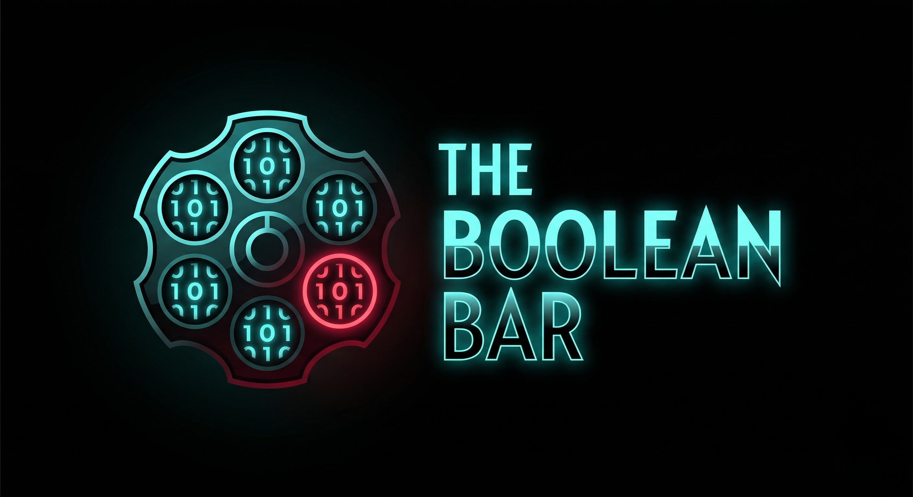

# 🥃 The Boolean Bar

<p align="center"><em>Onde a única verdade absoluta é a sua sobrevivência.</em></p>

<p align="center">
  
</p>

<p align="center">
  
  
  
  
</p>

---

## 🎯 Sobre o Projeto

The Boolean Bar é um simulador de mesa de apostas clandestina desenvolvido em C. O jogo desafia 7 jogadores em um ambiente de alta tensão, onde o "baralho" é composto por fórmulas de lógica proposicional. Para vencer, o jogador deve dominar a arte do blefe e a velocidade do raciocínio lógico, pois cada falha de verificação leva o personagem à Roleta Russa.

O projeto foi concebido para as cadeiras de Programação Imperativa e Funcional (PIF) e Lógica para Computação no CESAR School.

## 🔥 O Desafio Lógico

No bar, as cartas não têm números, mas proposições. O jogador deve afirmar a classificação da fórmula descartada:

```text
┌─────────────────────────────────────────────────────────────┐
│ Carta Jogada: (P ∧ ¬P)                                      │
│ Afirmação: "Isso é uma Tautologia!"                         │
│                                                             │
│ 🚨 OPONENTE DUVIDA!                                         │
│                                                             │
│ Resultado: (P ∧ ¬P) é uma CONTRADIÇÃO.                      │
│ Ação: O mentiroso puxa o gatilho.                           │
└─────────────────────────────────────────────────────────────┘
```

## ✨ Funcionalidades do Épico (The Boolean Bar v1.0)

As funcionalidades seguem rigorosamente os requisitos de funções de ação (ar, er, ir):

1.  **Inicializar Ambiente**: Alocar memória para jogadores e configurar o estado inicial da mesa.
2.  **Gerar Proposições**: Sortear conectivos e variáveis para compor fórmulas lógicas aleatórias.
3.  **Avaliar Veracidade**: Computar o valor de verdade (Tautologia/Contradição) para validar o blefe.
4.  **Executar "Duvidar"**: Confrontar a afirmação com o valor real e aplicar a punição lógica.
5.  **Operar Roleta**: Sortear a bala e verificar se o disparo ocorre conforme a probabilidade.
6.  **Filtrar Sobreviventes**: Percorrer a lista de jogadores usando Ponteiros de Função (Paradigma Funcional).

## 🏗️ Arquitetura Modular (C Enterprise)

O projeto é dividido em camadas desacopladas para garantir manutenibilidade e nota máxima em organização:

```text
The-Boolean-Bar/
├── main.c
├── Makefile
├── core/
│   ├── types.h
│   ├── memory.c
│   ├── memory.h
│   ├── input_handler.c
│   └── input_handler.h
├── modules/
│   ├── logic_engine.c
│   ├── logic_engine.h
│   ├── deck_manager.c
│   ├── deck_manager.h
│   ├── game_flow.c
│   └── game_flow.h
├── functional/
│   ├── predicates.c
│   └── predicates.h
└── ui/
    ├── terminal_art.c
    └── terminal_art.h
├── docs/                 # Documentação do projeto
│   ├── LOGIC_SYNTAX.md
│   ├── GAME_RULES.md
│   └── ARCHITECTURE_OVERVIEW.md
```

## 🛠️ Tech Stack & Conceitos Aplicados

| Camada         | Tecnologia / Conceito         | Justificativa                                        |
| :------------- | :---------------------------- | :--------------------------------------------------- |
| Linguagem      | C (Padrão C11)                | Requisito da cadeira de PIF.                         |
| Memória        | Alocação Dinâmica             | Uso de `malloc` e `free` para gerenciar a mesa e baralho. |
| Funcional      | Ponteiros de Função           | Implementação de comportamentos genéricos e filtros. |
| Lógica         | Cálculo Proposicional         | Validação automática de fórmulas via Tabelas-Verdade. |
| Interface      | CLI (ASCII Art)               | Estética sombria e imersiva via terminal.            |

## 👥 A Equipe (Squad 7)

| Membro        | Papel               | Responsabilidade Principal                                   |
| :------------ | :------------------ | :----------------------------------------------------------- |
| Renato Chong  | 🚀 Tech Lead        | Arquitetura, Integração de módulos e Code Review.            |
| Dev 2         | 🐍 Lógica (Logic Master) | Construir o avaliador de fórmulas proposicionais.            |
| Dev 3         | 🐍 Lógica (Logic Master) | Gerador aleatório de strings lógicas estáveis.               |
| Cauã Rêgo         | 🗄️ Backend (C Expert) | Gestão de memória (`malloc`/`free`) e TADs principais.       |
| Dev 5         | 🗄️ Backend (C Expert) | Controle de fluxo imperativo e motor de turnos.              |
| Luís Nunes    | 🎨 UI/UX (ASCII Designer) | Interface visual no terminal e sistema de cores ANSI.        |
| Dev 7         | 📄 QA & Docs        | Testes de estresse (inputs errados) e documentação lógica.   |

## 🚀 Como Rodar

```bash
# Clone o repositório
git clone https://github.com/seu-usuario/the-boolean-bar.git

# Navegue até o diretório do projeto
cd the-boolean-bar

# Compile via Makefile
make build

# Inicie o jogo
make run
```

<p align="center">Desenvolvido com <strong>C</strong> e <strong>Lógica Pura</strong> por estudantes de ADS.</p>
