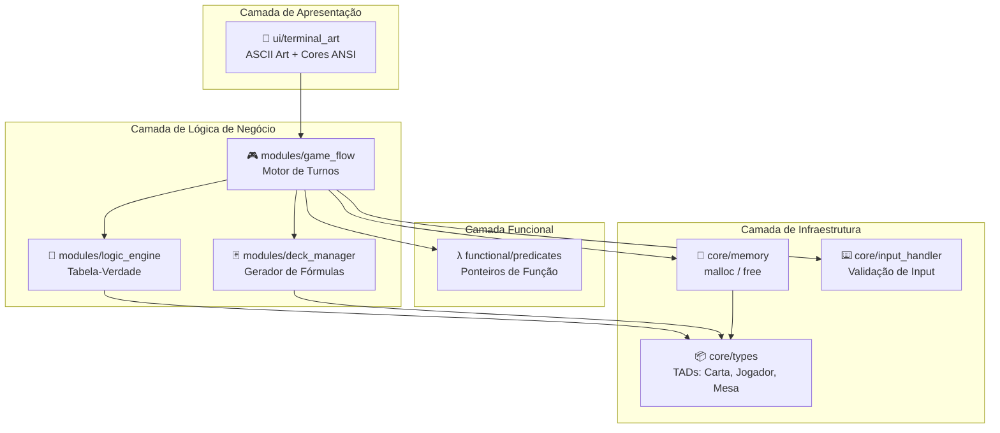
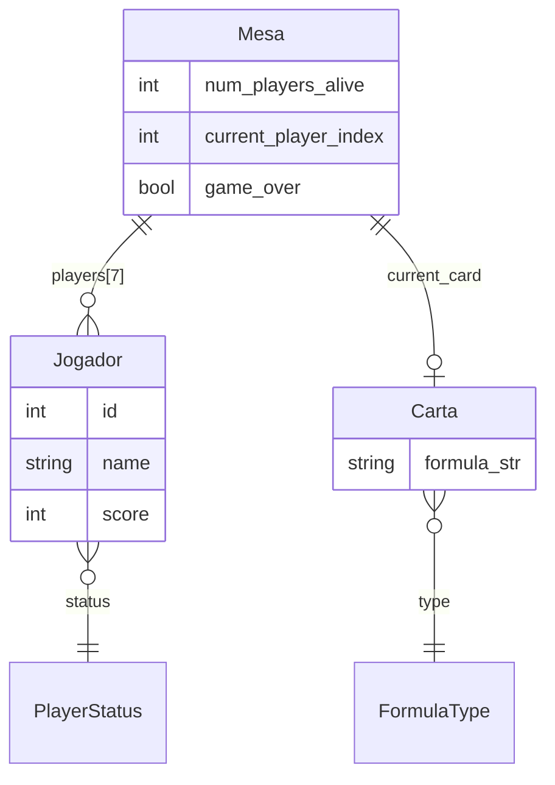
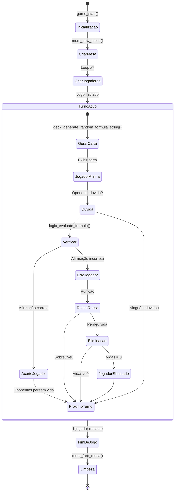
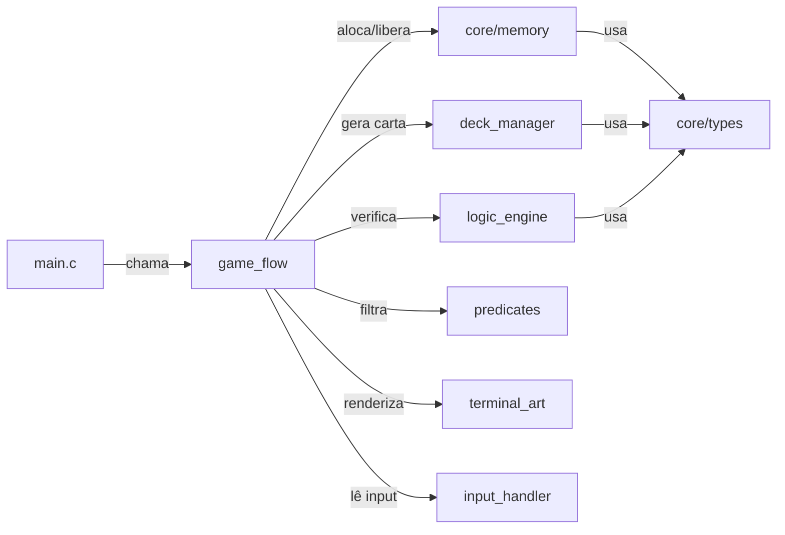

# 🥃 The Boolean Bar
<p align="center"><em>Enterprise-Grade Logic Game Engine & Web Platform</em></p>
<p align="center"><em>Onde a única verdade absoluta é a sua sobrevivência.</em></p>

<p align="center">
  
</p>

<p align="center">
  
  
  
  
  
  
</p>

---

## 🎮 Gameplay (Screencast)

<p align="center">
  <video src="./assets/Screencast.mp4" controls width="800"></video>
</p>

> **Nota:** Para ver a demonstração, certifique-se de que o arquivo `Screencast.mp4` está na pasta `assets/`.

---

## 🎯 Sobre o Projeto

**The Boolean Bar** é um simulador de mesa de apostas clandestina onde a moeda de troca é o raciocínio lógico. Desenvolvido com padrões de arquitetura de alto nível, o jogo desafia 7 jogadores a validarem fórmulas de lógica proposicional sob pressão, onde um erro técnico leva diretamente à Roleta Russa.

Concebido como um projeto de excelência para as cadeiras de **Programação Imperativa e Funcional (PIF)** e **Lógica para Computação** no CESAR School.

---

## 🔥 O Desafio Lógico

No bar, as cartas não têm números, mas proposições. O jogador deve afirmar a classificação da fórmula descartada:

```text
┌─────────────────────────────────────────────────────────────┐
│ Carta Jogada: (P ∧ ¬P)                                      │
│ Afirmação: "Isso é uma Tautologia!"                         │
│                                                             │
│ 🚨 OPONENTE DUVIDA!                                         │
│                                                             │
│ Resultado: (P ∧ ¬P) é uma CONTRADIÇÃO.                      │
│ Ação: O mentiroso puxa o gatilho.                           │
└─────────────────────────────────────────────────────────────┘
```

---

## ✨ Funcionalidades do Épico (The Boolean Bar v1.0)

As funcionalidades seguem rigorosamente os requisitos de funções de ação (ar, er, ir):

1.  **Inicializar Ambiente**: Alocar memória para jogadores e configurar o estado inicial da mesa.
2.  **Gerar Proposições**: Sortear conectivos e variáveis para compor fórmulas lógicas aleatórias.
3.  **Avaliar Veracidade**: Computar o valor de verdade (Tautologia/Contradição) para validar o blefe.
4.  **Executar "Duvidar"**: Confrontar a afirmação com o valor real e aplicar a punição lógica.
5.  **Operar Roleta**: Sortear a bala e verificar se o disparo ocorre conforme a probabilidade.
6.  **Filtrar Sobreviventes**: Percorrer a lista de jogadores usando Ponteiros de Função (Paradigma Funcional).

---

## 🏗️ Arquitetura Enterprise (Monorepo)

O projeto adota uma estrutura de **Monorepo**, segregando responsabilidades em workspaces independentes, mas orquestrados centralizadamente. Esta abordagem garante que o núcleo lógico (C) seja agnóstico em relação à interface (Web/CLI).

### Estrutura de Diretórios

```text
The-Boolean-Bar/
├── apps/                        # Aplicações e Workspaces
│   ├── engine/                  # 🧠 Game Engine Core (C11)
│   │   ├── src/                 # Implementação (.c)
│   │   ├── include/             # Interface Pública (.h)
│   │   │   └── core/            # Namespaced Headers
│   │   └── Makefile             # Build System Isolado
│   └── web/                     # 🌐 Web Platform Scaffold
│       └── src/                 # Domain-Driven Web UI
├── docs/                        # 📄 Documentação Centralizada
│   └── architecture/            # ADRs (Architectural Decision Records)
├── scripts/                     # 🛠️ Utilitários e Automação
├── Makefile                     # 🚀 Orquestrador Master (Root)
└── README.md                    # Manifesto do Sistema
```

### Decisões Arquiteturais (Senior Level)

-   **Physical Separation of Concerns**: O motor de jogo (`engine`) é totalmente isolado do frontend, permitindo builds independentes.
-   **Header Namespacing**: No motor C, as inclusões seguem o padrão profissional `#include "core/memory.h"`, garantindo clareza e organização.
-   **Out-of-Source Build**: Artefatos de compilação da engine são gerados em diretórios `build/` e `bin/` específicos, mantendo o código-fonte limpo.
-   **Master Orchestration**: O Makefile na raiz gerencia as dependências entre os workspaces.

---

## 🛠️ Tech Stack & Conceitos Aplicados

| Camada         | Tecnologia / Conceito         | Justificativa                                        |
| :------------- | :---------------------------- | :--------------------------------------------------- |
| Linguagem      | C (Padrão C11)                | Requisito da cadeira de PIF.                         |
| Memória        | Alocação Dinâmica             | Uso de `malloc` e `free` para gerenciar a mesa e baralho. |
| Funcional      | Ponteiros de Função           | Implementação de comportamentos genéricos e filtros. |
| Lógica         | Cálculo Proposicional         | Validação automática de fórmulas via Tabelas-Verdade. |
| Interface      | CLI (ASCII Art)               | Estética sombria e imersiva via terminal.            |

---

## 📊 Diagramas Técnicos

### Arquitetura em Camadas



### Modelo de Dados (Entidade-Relacionamento)



### Fluxo do Jogo (Máquina de Estados)



### Dependência entre Módulos



---

## 🛠️ Build System & Execução

O sistema utiliza um orquestrador centralizado para facilitar o fluxo de desenvolvimento.

| Comando         | Descrição                                                                 |
| :-------------- | :------------------------------------------------------------------------ |
| `make engine`   | Compila o motor em C (Engine) gerando o binário em `apps/engine/bin`.     |
| `make clean`    | Remove todos os artefatos de build de todos os workspaces.                |
| `make kill`     | (Windows) Encerra processos (Node/Esbuild) que possam bloquear exclusões. |
| `make help`     | Exibe os comandos e documentação do build system.                         |

### Como Rodar (Engine):
```bash
make engine
./apps/engine/bin/boolean_bar_engine
```

---

## 📚 Documentação e Guias do Squad

Como um projeto de alta colaboração, mantemos uma base de conhecimento detalhada para cada módulo e membro do time.

### Documentação Técnica Principal
| Documento | Descrição |
| :-------- | :-------- |
| [ARCHITECTURE_OVERVIEW.md](docs/ARCHITECTURE_OVERVIEW.md) | Visão detalhada da arquitetura modular e monorepo. |
| [API_REFERENCE.md](docs/API_REFERENCE.md) | Referência completa das funções, TADs e fluxos. |
| [GAME_RULES.md](docs/GAME_RULES.md) | Regras oficiais da mesa de apostas e lógica. |
| [LOGIC_SYNTAX.md](docs/LOGIC_SYNTAX.md) | Manual de sintaxe para as fórmulas lógicas. |

### 👥 Guias de Estudo Individual (Squad 7)
Cada membro do squad mantém um guia de referência rápida sobre suas responsabilidades e aprendizados:

- [x] **Tech Lead:** [Renato Chong](docs/guia-renato.md)
- [ ] **Logic Masters:** [João Pedro](docs/guia-joaopedro.md) & [Fernando Andrade](docs/guia-fernando.md)
- [ ] **C Experts:** [Cauã Rêgo](docs/guia-caua.md) & [Matheus Larré](docs/guia-matheus.md)
- [ ] **UI/UX Designer:** [Luís Nunes](docs/guia-luis.md)
- [ ] **QA & Docs:** [Gabriel Brito](docs/guia-gabriel.md)

---

## 👥 A Equipe (Squad 7)

| Membro           | Papel                     | Responsabilidade Principal                                   |
| :--------------- | :------------------------ | :----------------------------------------------------------- |
| Renato Chong     | 🚀 Tech Lead              | Arquitetura Enterprise, Integração de módulos e Code Review. |
| João Pedro       | 🐍 Lógica (Logic Master)  | Construir o avaliador de fórmulas proposicionais.            |
| Fernando Andrade | 🐍 Lógica (Logic Master)  | Gerador aleatório de strings lógicas estáveis.               |
| Cauã Rêgo        | 🗄️ Backend (C Expert)    | Gestão de memória (`malloc`/`free`) e TADs principais.       |
| Matheus Larré    | 🗄️ Backend (C Expert)    | Controle de fluxo imperativo e motor de turnos.              |
| Luís Nunes       | 🎨 UI/UX (ASCII Designer) | Interface visual no terminal e sistema de cores ANSI.        |
| Gabriel Brito    | 📄 QA & Docs              | Testes de estresse (inputs errados) e documentação lógica.   |

<p align="center">
  Desenvolvido com <strong>C11</strong> e <strong>Paixão pela Arquitetura Clean</strong> por estudantes de ADS.
</p>
