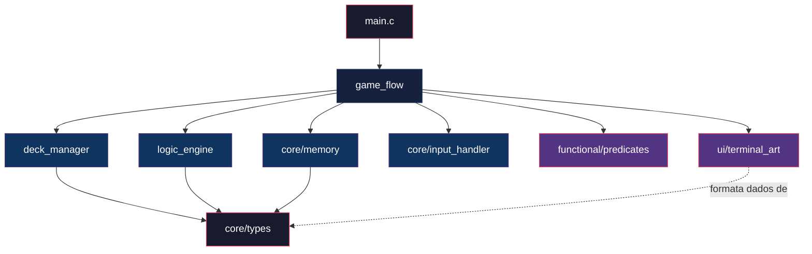
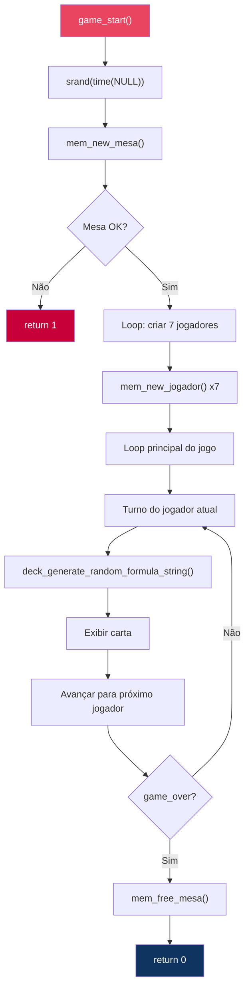

# 📖 Referência de API — The Boolean Bar

> Documentação completa de todas as funções públicas expostas pelos módulos do projeto.

---

## Diagrama de Dependência entre Módulos



---

## 1. `core/memory` — Gestão de Memória

Gerencia alocação e desalocação dinâmica para todas as TADs do projeto.

### `mem_new_carta`

```c
Carta* mem_new_carta(const char *formula_str, FormulaType type);
```

| Parâmetro      | Tipo          | Descrição                                   |
| :------------- | :------------ | :------------------------------------------ |
| `formula_str`  | `const char*` | String da fórmula lógica (será duplicada)   |
| `type`         | `FormulaType` | Classificação da fórmula                    |
| **Retorno**    | `Carta*`      | Ponteiro para nova `Carta`, ou `NULL`       |

**Comportamento:** Aloca `Carta` via `malloc`, duplica `formula_str` via `strdup`. Valida parâmetros não-nulos.

---

### `mem_new_jogador`

```c
Jogador* mem_new_jogador(int id, const char *name);
```

| Parâmetro   | Tipo          | Descrição                                  |
| :---------- | :------------ | :----------------------------------------- |
| `id`        | `int`         | ID único do jogador                        |
| `name`      | `const char*` | Nome do jogador (será duplicado)           |
| **Retorno** | `Jogador*`    | Ponteiro para novo `Jogador`, ou `NULL`    |

**Comportamento:** Inicializa `status = ALIVE` e `score = 3`.

---

### `mem_new_mesa`

```c
Mesa* mem_new_mesa();
```

| **Retorno** | `Mesa*` | Ponteiro para nova `Mesa`, ou `NULL` |
| :---------- | :------ | :----------------------------------- |

**Comportamento:** Inicializa `players[]` como `NULL`, `num_players_alive = 0`, `game_over = false`.

---

### `mem_free_carta`

```c
void mem_free_carta(Carta *card);
```

> ⚠️ **Status:** Stub — corpo apenas com guard clause. Implementação pendente (liberar `formula_str` + struct).

---

### `mem_free_jogador`

```c
void mem_free_jogador(Jogador *player);
```

> ⚠️ **Status:** Stub — corpo apenas com guard clause. Implementação pendente (liberar `name` + struct).

---

### `mem_free_mesa`

```c
void mem_free_mesa(Mesa *table);
```

> ⚠️ **Status:** Stub — corpo apenas com guard clause. Implementação pendente (iterar `players[]`, liberar `current_card`, liberar struct).

---

## 2. `core/input_handler` — Validação de Entrada

### Status: 🔴 Não Implementado

Módulo previsto para validação e sanitização de entradas do usuário. Ambos `input_handler.c` e `input_handler.h` estão vazios.

**Responsabilidades planejadas:**
- Ler input do jogador (teclado)
- Validar opções de menu (Tautologia / Contradição / Contingência)
- Proteger contra buffer overflow e entradas inválidas

---

## 3. `modules/logic_engine` — Avaliador de Fórmulas

### `logic_evaluate_formula`

```c
FormulaType logic_evaluate_formula(const char *formula_str);
```

| Parâmetro      | Tipo          | Descrição                                       |
| :------------- | :------------ | :---------------------------------------------- |
| `formula_str`  | `const char*` | String da fórmula a ser classificada            |
| **Retorno**    | `FormulaType` | `TAUTOLOGY`, `CONTRADICTION` ou `CONTINGENCY`  |

> ⚠️ **Status:** Placeholder — sempre retorna `CONTINGENCY`. Implementação prevista:
> 1. Parsing da fórmula (construir AST)
> 2. Extração de variáveis proposicionais
> 3. Construção de tabela-verdade (2^N linhas)
> 4. Classificação baseada nos resultados

---

## 4. `modules/deck_manager` — Gerador de Cartas

### `deck_generate_random_formula_string`

```c
char* deck_generate_random_formula_string();
```

| **Retorno** | `char*` | String alocada dinamicamente, ou `NULL` |
| :---------- | :------ | :-------------------------------------- |

> ⚠️ **Status:** Placeholder — sempre retorna `"P AND Q"`. Implementação prevista:
> - Seleção aleatória de variáveis (`P`, `Q`, `R`...)
> - Inclusão aleatória de conectivos (`AND`, `OR`, `NOT`, `IMPLIES`, `IFF`)
> - Balanceamento de parênteses
> - Controle de complexidade/profundidade

**Nota:** O chamador é responsável por `free()` da string retornada.

---

## 5. `modules/game_flow` — Motor do Jogo

### `game_start`

```c
int game_start();
```

| **Retorno** | `int` | `0` = sucesso, `1` = erro |
| :---------- | :---- | :------------------------ |

**Fluxo implementado:**



**Estado atual:** Loop principal limitado a 3 turnos como placeholder (variável estática `turns_played`).

---

## 6. `functional/predicates` — Programação Funcional

### Status: 🔴 Não Implementado

Módulo previsto para implementar filtros com ponteiros de função.

**Responsabilidades planejadas:**
- `filter_alive_players(Mesa*)` — Filtrar jogadores com `status == ALIVE`
- Funções genéricas de `map`, `filter`, `reduce` sobre arrays de `Jogador*`
- Predicados booleanos reutilizáveis

---

## 7. `ui/terminal_art` — Interface Visual

### `ui_print_colored`

```c
void ui_print_colored(const char *text, const char *color_code);
```

Imprime texto formatado com cor ANSI. Reset automático ao final.

---

### `ui_draw_header`

```c
void ui_draw_header(const char *title);
```

Desenha um cabeçalho centralizado de 80 colunas com bordas amarelas e título ciano em negrito.

**Exemplo de saída:**
```
================================================================================
||                           THE BOOLEAN BAR                                  ||
================================================================================
```

---

### `ui_clear_screen`

```c
void ui_clear_screen();
```

Limpeza de tela via sequência ANSI `\x1b[2J\x1b[H` com `fflush(stdout)`.

---

## Constantes ANSI Disponíveis (`terminal_art.h`)

| Macro                  | Código       | Efeito          |
| :--------------------- | :----------- | :-------------- |
| `ANSI_COLOR_RESET`     | `\x1b[0m`   | Reset           |
| `ANSI_COLOR_BLACK`     | `\x1b[30m`  | Preto           |
| `ANSI_COLOR_RED`       | `\x1b[31m`  | Vermelho        |
| `ANSI_COLOR_GREEN`     | `\x1b[32m`  | Verde           |
| `ANSI_COLOR_YELLOW`    | `\x1b[33m`  | Amarelo         |
| `ANSI_COLOR_BLUE`      | `\x1b[34m`  | Azul            |
| `ANSI_COLOR_MAGENTA`   | `\x1b[35m`  | Magenta         |
| `ANSI_COLOR_CYAN`      | `\x1b[36m`  | Ciano           |
| `ANSI_COLOR_WHITE`     | `\x1b[37m`  | Branco          |
| `ANSI_STYLE_BOLD`      | `\x1b[1m`   | Negrito         |
| `ANSI_STYLE_ITALIC`    | `\x1b[3m`   | Itálico         |
| `ANSI_STYLE_UNDERLINE` | `\x1b[4m`   | Sublinhado      |
