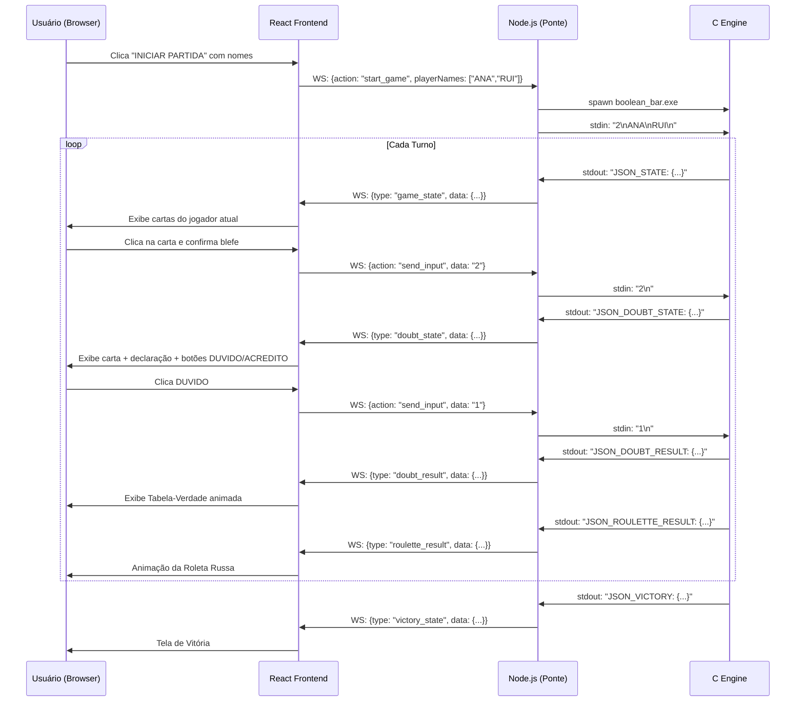

# 🥃 The Boolean Bar — Documento Técnico de Defesa

> **Projeto acadêmico desenvolvido para as cadeiras de Programação Imperativa e Funcional (PIF) e Lógica para Computação — CESAR School.**
> Este documento destina-se à apresentação do projeto perante a banca avaliadora.

---

## 1. Visão Geral do Projeto

**The Boolean Bar** é um simulador de mesa de apostas clandestina com tema de bar —  onde as "cartas" não têm números, mas **fórmulas de lógica proposicional**. O objetivo do jogador é classificar corretamente a fórmula da carta que está jogando (Tautologia, Contradição ou Contingência) ou blefar com sucesso enquanto esconde a classificação real.

Cada acusação de blefe resulta em um **confronto lógico verificado computacionalmente**: a engine em C avalia a tabela-verdade da fórmula em tempo real e determina o vencedor do confronto. O perdedor enfrenta a **Roleta Russa**, com probabilidade crescente a cada rodada.

O projeto integra **dois paradigmas de programação exigidos pela cadeira** — imperativo e funcional — com uma **interface visual moderna em React**, conectados por um **servidor ponte em Node.js via WebSocket**.

---

## 2. Stack Tecnológica Geral

```
┌─────────────────────────────────────────────────────────────────────┐
│                        THE BOOLEAN BAR                               │
│                                                                     │
│  ┌──────────────────┐    WebSocket    ┌──────────────────────────┐  │
│  │  Frontend React  │ ◄────────────► │  Node.js (Ponte)         │  │
│  │  (Vite + TS)     │                │  web_server.js           │  │
│  └──────────────────┘                └──────────┬───────────────┘  │
│                                                 │ stdin/stdout      │
│                                         ┌───────▼──────────────┐   │
│                                         │  Engine C (C11)       │   │
│                                         │  boolean_bar.exe      │   │
│                                         └──────────────────────┘   │
└─────────────────────────────────────────────────────────────────────┘
```

| Camada | Tecnologia | Função |
|--------|-----------|--------|
| **Engine** | C11 (GCC / MinGW) | Toda a lógica de jogo, avaliação proposicional e roleta |
| **Ponte** | Node.js (ES Modules) | Servidor WebSocket que faz a mediação C ↔ React |
| **Frontend** | React + TypeScript + Vite | Interface visual interativa do jogo |
| **Estilização** | Tailwind CSS | Design system dark/neon do bar |
| **Build** | GNU Make (Makefile) | Automatiza compilação, execução e ambiente de dev |

---

## 3. Backend — A Engine em C (C11)

### 3.1 Por que C?

A escolha do C não é apenas um requisito da cadeira — ela tem uma justificativa técnica fundamental: **controle total sobre memória e execução**. Em um jogo de probabilidades e lógica computacional, não pode haver comportamento não-determinístico causado por um garbage collector (como em Java) ou gerenciamento automático implícito (como em Python). Em C, cada bit do estado do jogo é explicitamente alocado e liberado.

O padrão **C11** foi adotado por trazer `stdbool.h` (tipo `bool`) e melhorias em threads — recursos que tornam o código mais legível sem abrir mão do controle de baixo nível.

### 3.2 Arquitetura em Camadas do C

O projeto segue uma **arquitetura modular em camadas** inspirada em projetos C de nível empresarial (C Enterprise):

```
The-Boolean-Bar/
│
├── main.c                  ← Ponto de entrada. Apenas chama game_start()
│
├── core/                   ← Infraestrutura base (nenhuma regra de negócio aqui)
│   ├── types.h             ← Definição das TADs: Carta, Jogador, Mesa
│   ├── memory.c/h          ← malloc/free encapsulados em funções seguras
│   └── input_handler.c/h  ← Leitura e validação de entrada do usuário
│
├── modules/                ← Lógica de negócio (o "coração" do jogo)
│   ├── logic_engine.c/h   ← Parser + avaliador de fórmulas proposicionais
│   ├── deck_manager.c/h   ← Gerador aleatório de fórmulas lógicas
│   └── game_flow.c/h      ← Motor de turnos e regras do jogo
│
├── functional/             ← Implementações de paradigma funcional
│   └── predicates.c/h     ← Funções de ordem superior com ponteiros de função
│
└── ui/
    └── terminal_art.c/h   ← Renderização ASCII e cores ANSI (interface original)
```

O `main.c` é intencionalmente minimalista — ele apenas delega a execução para `game_flow.c`, seguindo o princípio de **separação de responsabilidades**:

```c
int main(void) {
    int error = game_start();  // Tudo começa e termina aqui
    return error;
}
```

### 3.3 Paradigma Imperativo — `game_flow.c`

O módulo `game_flow.c` implementa o **paradigma imperativo** requerido pela cadeira. Ele orquestra o jogo através de um loop `while` que representa a **máquina de estados** do jogo:

```
[Inicialização] → [Loop de Turnos] → [Confronto] → [Roleta] → [Vitória]
```

Dentro de cada turno:
1. **Estado emitido** → `print_json_state()` serializa o estado completo para o WebSocket
2. **Jogador escolhe** a carta e declara o tipo
3. **Oponente decide** se duvida ou acredita
4. **Engine verifica** chamando `logic_evaluate_formula()`
5. **Roleta executada** com probabilidade `balas/6` crescente

### 3.4 Paradigma Funcional — `predicates.c`

A camada `functional/` demonstra o **paradigma funcional** através de **ponteiros de função** (higher-order functions em C):

```c
// Predicado: função que recebe um Jogador e retorna bool
bool is_alive(Jogador *p) {
    return p != NULL && p->estaVivo && p->status == ALIVE;
}

// Função de ordem superior: aceita qualquer predicado como argumento
int get_next_valid_player_index(Mesa *mesa, int current_index, 
                                bool (*predicate)(Jogador *)) {
    for (int i = 1; i <= MAX_PLAYERS; i++) {
        int idx = (current_index + i) % MAX_PLAYERS;
        if (mesa->players[idx] != NULL && predicate(mesa->players[idx]))
            return idx;
    }
    return -1;
}
```

Isso permite passar `is_alive` como argumento — comportamento similar a um `filter()` do paradigma funcional — **sem depender de funções de alto nível de uma biblioteca**. A função que busca o próximo jogador não sabe *o que* está procurando; ela apenas aplica o predicado recebido.

### 3.5 Motor Lógico — `logic_engine.c`

O coração computacional do projeto: um **parser recursivo descendente** que avalia fórmulas proposicionais.

Funcionamento:
1. Recebe uma string como `"( P AND NOT Q )"`
2. Itera por todas as **8 combinações possíveis** de P, Q, R (tabela-verdade completa com 3 variáveis)
3. Para cada linha, avalia a expressão usando o parser
4. Classifica o resultado:
   - Todas as 8 linhas `true` → **TAUTOLOGIA**
   - Todas as 8 linhas `false` → **CONTRADIÇÃO**
   - Misto → **CONTINGÊNCIA**

```c
for (int i = 0; i < 8; i++) {
    Parser p = {formula_str, 0,
                (i & 4) != 0,   // P = bit 2
                (i & 2) != 0,   // Q = bit 1
                (i & 1) != 0};  // R = bit 0
    bool result = parse_expr(&p);
    if (result) true_count++;
    else        false_count++;
}
```

O parser suporta: variáveis `P`, `Q`, `R`, operadores `AND`, `OR`, `NOT` e agrupamento com parênteses — suficiente para toda a sintaxe do jogo.

### 3.6 Gerador de Cartas — `deck_manager.c`

O `deck_manager` gera fórmulas aleatórias usando 5 modelos estruturais:

| Modelo | Exemplo | Garantia |
|--------|---------|----------|
| 0 | `( P OR NOT P )` | Sempre Tautologia |
| 1 | `( P AND NOT P )` | Sempre Contradição |
| 2 | `( P AND Q )` | Contingência |
| 3 | `NOT ( P OR Q )` | Contingência |
| 4 | `( ( P AND Q ) OR R )` | Contingência ou Tautologia |

Isso cria um **baralho naturalmente variado** — o jogador nunca sabe de antemão se a carta é trivial ou ambígua, tornando o blefe mais estratégico.

### 3.7 Gerenciamento de Memória — `core/memory.c`

Toda alocação dinâmica passa pelas funções encapsuladas em `memory.c`:

```c
Mesa*    mem_new_mesa()               // Aloca a mesa de jogo
Jogador* mem_new_jogador(id, nome)    // Aloca um jogador
Carta*   mem_new_carta(formula, tipo) // Aloca uma carta
void     mem_free_mesa(mesa)          // Libera toda a memória recursivamente
```

Essa encapsulação garante que **nenhum módulo chame `malloc`/`free` diretamente**, centralizando o controle de memória e prevenindo vazamentos (memory leaks).

---

## 4. Comunicação C ↔ Frontend — A Ponte WebSocket

### 4.1 O Problema Resolvido

O C é uma linguagem de **linha de comando** — ela lê de `stdin` e escreve em `stdout`. O React é uma SPA (Single Page Application) que roda no browser. **Essas duas tecnologias não se comunicam diretamente.**

A solução foi criar uma **camada de mediação** (bridge/ponte) em Node.js que:
- Gerencia o processo C como um **subprocesso** (`spawn`)
- Expõe um **servidor WebSocket** para o React se conectar
- **Traduz** as mensagens em ambas as direções

### 4.2 Protocolo de Comunicação

```
React                  Node.js              boolean_bar.exe (C)
  │                      │                         │
  │── WebSocket MSG ────►│                         │
  │   { action: "start_game",                      │
  │     playerNames: ["ANA","RUI"] }               │
  │                      │── stdin write ─────────►│
  │                      │   "2\nANA\nRUI\n"        │
  │                      │                         │
  │                      │◄── stdout lines ─────── │
  │                      │   "JSON_STATE: {...}"    │
  │◄── WebSocket MSG ────│                         │
  │   { type: "game_state", data: {...} }           │
  │                      │                         │
  │── WebSocket MSG ────►│                         │
  │   { action: "send_input", data: "1" }          │
  │                      │── stdin write ─────────►│
  │                      │   "1\n"                  │
```

### 4.3 Protocolo JSON do C

O C emite eventos estruturados via `printf` + `fflush(stdout)`:

| Evento JSON | Quando emitido | Payload |
|-------------|----------------|---------|
| `JSON_STATE` | Início de cada turno | Jogadores, mão atual, balas, turno |
| `JSON_DOUBT_STATE` | Quando um confronto é iniciado | Acusador, acusado, carta, declaração |
| `JSON_DOUBT_RESULT` | Após verificação lógica | Perdedor, se houve blefe, tipo real |
| `JSON_ROULETTE_RESULT` | Após a roleta | Jogador, sobreviveu, vidas restantes, balas |
| `JSON_VICTORY` | Fim de jogo | Vencedor, total de jogadores |

Exemplo real do `JSON_STATE`:
```json
{
  "players": [
    { "name": "ANA", "alive": true, "cards": 5, "lives": 3 },
    { "name": "RUI", "alive": true, "cards": 4, "lives": 2 }
  ],
  "currentHand": ["( P AND Q )", "( P OR NOT P )", "NOT ( Q OR R )"],
  "turn": 0,
  "totalPlayers": 2,
  "bullets": 2
}
```

### 4.4 Por que WebSocket e não HTTP?

| Critério | HTTP REST | WebSocket |
|----------|-----------|-----------|
| Comunicação | Request-Response (cliente inicia) | **Bidirecional** (ambos iniciam) |
| Latência | Alta (nova conexão por request) | **Baixa** (conexão persistente) |
| Push de dados | Não nativo (precisa de polling) | **Nativo** (servidor empurra dados) |
| Ideal para | APIs, CRUD | **Jogos em tempo real, chat, dashboards** |

O C precisa **empurrar** eventos para o React (ex: quando a roleta acontece, o C notifica). Com HTTP, o React teria que ficar perguntando o tempo todo ("polling"). Com WebSocket, o C **emite quando quiser** e o React reage instantaneamente.

### 4.5 Por que Node.js como ponte?

O Node.js foi escolhido como middleware por três razões:

1. **`child_process.spawn`** — API nativa para criar e controlar processos externos (o C), com acesso a `stdin`/`stdout` por pipes
2. **Pacote `ws`** — implementação WebSocket leve, sem overhead de um framework completo
3. **Compatibilidade com o frontend** — Node usa o mesmo runtime do Vite, simplificando o toolchain

---

## 5. Frontend — A Interface React

### 5.1 Por que React + TypeScript?

O React foi escolhido por três razões principais:

**1. Reatividade declarativa** — O estado do jogo é complexo e muda frequentemente. Com React, basta atualizar o estado (`useState`) e a UI re-renderiza automaticamente, sem manipulação manual do DOM.

**2. Componentização** — Cada tela do jogo (Lobby, GamePage, Roleta, Eliminação, Vitória) é um componente isolado e reutilizável, facilitando manutenção e adição de novas telas.

**3. TypeScript** — O protocolo JSON do C é tipado via interfaces TypeScript, garantindo que o frontend nunca acesse um campo que não existe:

```typescript
export interface GameState {
  players: PlayerState[];
  currentHand: string[];   // Cartas do jogador atual
  turn: number;
  bullets: number;
}
```

### 5.2 Estrutura do Frontend

```
figma_export/src/
├── App.tsx                    ← Roteador de telas (menu → lobby → game)
├── hooks/
│   └── useGameEngine.ts       ← Toda a lógica WebSocket encapsulada
├── pages/
│   ├── MainMenu.tsx           ← Tela inicial
│   ├── Lobby.tsx              ← Configuração de jogadores
│   └── GamePage.tsx           ← Tela principal do jogo
└── components/
    ├── ui/LogicCard.tsx       ← Carta com fórmula lógica
    ├── screens/               ← Telas de overlay (Eliminação, Vitória, Roleta)
    └── modals/                ← Modais (Blefe, Dúvida, Instruções)
```

### 5.3 O Hook `useGameEngine` — Separação de Responsabilidades

Todo o acoplamento com o WebSocket é **isolado em um único hook customizado**: `useGameEngine.ts`. O resto do frontend **nunca vê** o WebSocket — ele apenas consome o estado e as funções que o hook expõe:

```typescript
const gameEngine = useGameEngine();

// O hook provê estado reativo:
gameEngine.gameState      // Estado completo da partida
gameEngine.wsStatus       // 'connected' | 'connecting' | 'disconnected'
gameEngine.doubtState     // Dados do confronto ativo

// E funções:
gameEngine.startGame(nomes)   // Inicia partida com os jogadores
gameEngine.sendInput("1")     // Envia resposta ao C (escolha de carta, duvidou/acreditou)
gameEngine.sendShutdown()     // Encerra servidor Node e fecha o browser
```

Esse padrão de **Custom Hook** é uma das melhores práticas de arquitetura React — equivalente ao padrão Repository no backend.

### 5.4 Por que Vite como bundler?

Vite foi escolhido em detrimento do Create React App (CRA) por:
- **HMR (Hot Module Replacement)** instantâneo — mudanças no código refletem no browser em menos de 100ms durante o desenvolvimento
- **Build de produção com Rollup** — bundle final otimizado e pequeno
- **Suporte nativo a TypeScript** — sem configuração extra

---

## 6. Automação — O Makefile

O `Makefile` automatiza **todo o ciclo de vida do desenvolvimento** em comandos simples:

```makefile
make          # Compila o C (gera boolean_bar.exe)
make dev      # Compila + sobe Node + Vite + abre browser automaticamente
make kill     # Encerra todos os processos do projeto
make restart  # Kill + Dev (reinício limpo)
make clean    # Remove todos os .o e .exe
```

### 6.1 Decisões de Engenharia no Makefile

**Compilação incremental** — O Make usa timestamps dos arquivos `.o` para recompilar **apenas os módulos alterados**, otimizando o tempo de build.

**Execução silenciosa em background** — O `make dev` usa `Start-Process -WindowStyle Hidden` (PowerShell) para subir o Node e o Vite **sem abrir janelas de terminal**:

```makefile
@powershell -Command "Start-Process -FilePath 'cmd.exe' \
    -ArgumentList '/c cd figma_export && node web_server.js' \
    -WindowStyle Hidden"
```

**Abertura automática do browser** — Após 4 segundos (tempo do Vite compilar), o browser é aberto automaticamente:
```makefile
@powershell -Command "Start-Sleep -Seconds 4; Start-Process 'http://localhost:5173'"
```

**Proteção de sobrescrita do `.exe`** — Antes de compilar, o `taskkill` mata qualquer instância anterior do processo, evitando o erro `Permission denied` do linker:
```makefile
-taskkill /F /IM boolean_bar.exe >NUL 2>&1
```

---

## 7. Fluxo Completo de uma Partida



---

## 8. Decisões de Design — Perguntas Frequentes de Banca

### "Por que não usar sockets diretamente entre C e React?"

O browser **não pode abrir sockets TCP nativos** por razões de segurança (sandbox). O WebSocket é o protocolo de comunicação bidirecional permitido em browsers. O Node.js atua como o servidor WebSocket que os browsers conseguem acessar — e como intermediário que controla o processo C via pipe de sistema operacional.

### "Por que não implementar a UI diretamente no terminal em C?"

A interface de terminal original (usando `terminal_art.c`) foi mantida e ainda funciona com `make run`. A interface React é uma **extensão** que adiciona uma experiência visual rica sem remover a engine original. Isso demonstra boa prática de **separação de responsabilidades**: a lógica do jogo é agnóstica à forma de apresentação.

### "O paradigma funcional é genuíno ou só para cumprir o requisito?"

A implementação de `predicates.c` é genuinamente funcional: `get_next_valid_player_index` é uma **função de ordem superior** que recebe outra função como argumento (`bool (*predicate)(Jogador *)`). Isso é equivalente a um `filter()` ou `find()` em linguagens funcionais como Haskell ou JavaScript. A função de busca não conhece a lógica do predicado — ela apenas o aplica, exemplificando o princípio de **abstração de comportamento**.

### "Como é garantida a consistência de estado entre C e React?"

O C é a **fonte da verdade** (single source of truth). Ele emite o estado completo do jogo a cada turno via `JSON_STATE`. O React nunca assume um estado — ele apenas renderiza o que o C diz. Para evitar que as cartas "desapareçam" entre eventos, o frontend usa um `useRef` que persiste a **última mão válida recebida**, mesmo que o estado seja momentaneamente nulo durante a transição entre eventos.

---

## 9. Resumo Técnico para a Banca

| Aspecto | Solução Adotada | Justificativa |
|---------|----------------|---------------|
| Linguagem principal | C11 | Requisito da cadeira + controle de memória |
| Paradigma imperativo | `game_flow.c` com loop de estados | Controle explícito de fluxo |
| Paradigma funcional | `predicates.c` com ponteiros de função | Abstração de comportamento sem bibliotecas |
| Avaliação lógica | Parser recursivo descendente | Avalia qualquer fórmula P/Q/R em tempo real |
| Comunicação cross-platform | WebSocket (porta 8080) | Único protocolo bidirecional suportado por browsers |
| Interface visual | React + TypeScript | Reatividade ao estado do C sem acoplamento |
| Build e DevOps | GNU Makefile | Um comando faz tudo: compila, sobe e abre o browser |
| Número de jogadores | Dinâmico (2 a 7) | C lê o count no `stdin` antes dos nomes |

---

<p align="center"><em>Desenvolvido com C e Lógica Pura — CESAR School, 2025/2026</em></p>
<p align="center"><strong>Squad 7:</strong> Renato Chong · João Pedro · Fernando Andrade · Cauã Rêgo · Matheus Larré · Luís Nunes · Gabriel Brito</p>
