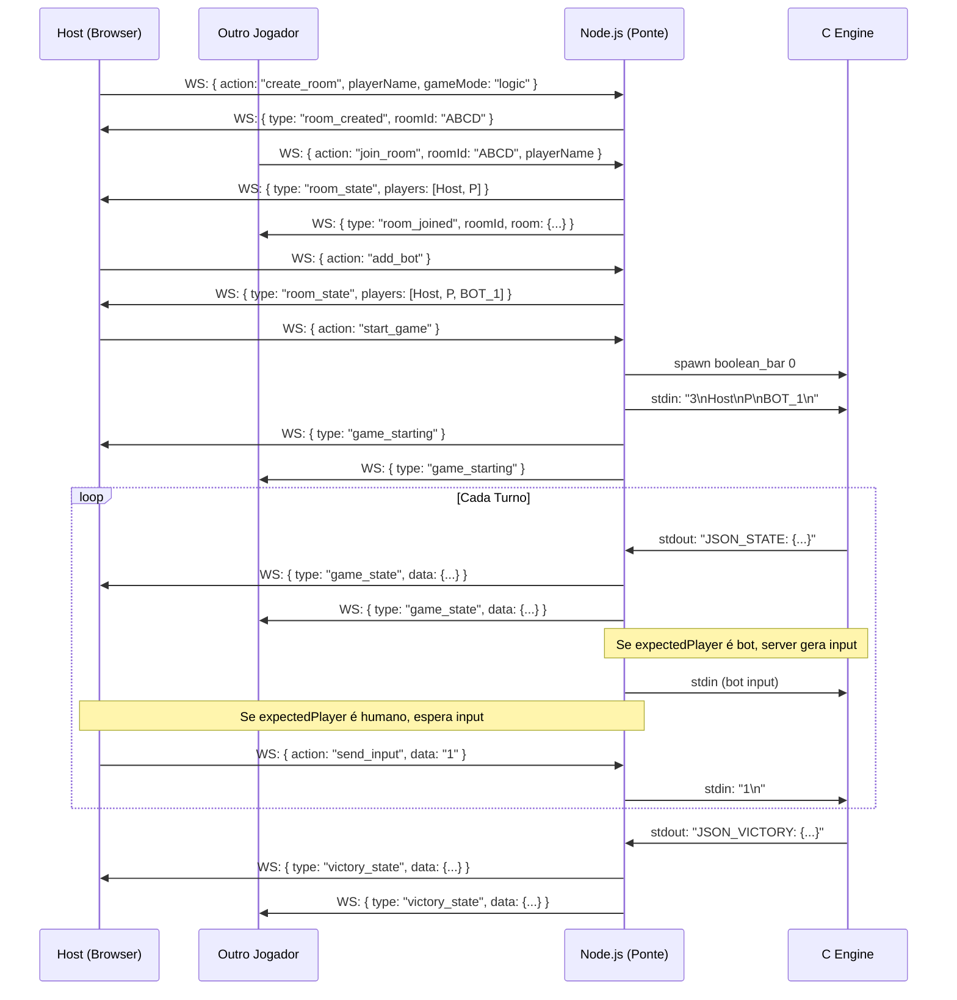

# 🥃 The Boolean Bar — Documento Técnico de Defesa

> **Projeto acadêmico desenvolvido para as cadeiras de Programação Imperativa e Funcional (PIF) e Lógica para Computação — CESAR School.**
> Este documento destina-se à apresentação do projeto perante a banca avaliadora.

---

## 1. Visão Geral do Projeto

**The Boolean Bar** é um simulador de mesa de apostas clandestina com tema de bar, com **dois modos de jogo** rodando sobre a mesma engine em C:

- **Modo Boolean Bar (Lógica)** — As cartas não têm números, mas **fórmulas de lógica proposicional**. O jogador descarta uma carta declarando se é Tautologia, Contradição ou Contingência. O adversário pode duvidar; o engine avalia a tabela-verdade da fórmula em tempo real e quem mente (ou duvida injustamente) enfrenta a **Roleta Russa**, com probabilidade crescente a cada rodada.
- **Modo Liar's Dice (Dados)** — Cada jogador tem 5 dados em copo escondido. Apostas são feitas sobre a quantidade total de uma face na mesa toda. Quem duvida e errar perde 1 dado; quem fizer aposta inflada e for descoberto, idem. Zero dados = eliminado. Último com dados vence.

A solução está **publicada em produção** em https://rsc3-boolean.duckdns.org, rodando em uma VM GCP com nginx + HTTPS + PM2. Suporta **multiplayer em tempo real** com salas, reconexão automática, bots controlados pelo server e até 7 jogadores por mesa.

O projeto integra **dois paradigmas de programação exigidos pela cadeira** — imperativo e funcional — com uma **interface visual moderna em React**, conectados por um **servidor ponte em Node.js via WebSocket**.

---

## 2. Stack Tecnológica Geral

```
┌──────────────────────────────────────────────────────────────────────────┐
│                        THE BOOLEAN BAR                                    │
│                                                                           │
│  ┌──────────────────┐     WebSocket      ┌──────────────────────────┐    │
│  │  Frontend React  │ ◄────────────────► │  Node.js (Ponte)         │    │
│  │  (Vite + TS)     │                    │  web_server.js           │    │
│  └──────────────────┘                    └──────────┬───────────────┘    │
│                                                     │ stdin/stdout       │
│                                          ┌──────────▼─────────────┐      │
│                                          │  Engine C (C11)         │      │
│                                          │  boolean_bar(.exe)      │      │
│                                          │  modo: logic | dice     │      │
│                                          └─────────────────────────┘      │
│                                                                           │
│  ───────────────────  EM PRODUÇÃO (VM GCP) ──────────────────────         │
│  Browser ─► nginx (HTTPS) ─► Node.js + Engine C ─► PM2 (process mgr)      │
└──────────────────────────────────────────────────────────────────────────┘
```

| Camada | Tecnologia | Função |
|--------|-----------|--------|
| **Engine** | C11 (GCC / MinGW) | Toda a lógica dos 2 modos de jogo, avaliação proposicional, roleta, dados |
| **Ponte** | Node.js (ES Modules) + `ws` | Servidor WebSocket que faz a mediação C ↔ React e gerencia salas |
| **Frontend** | React 18 + TypeScript + Vite | Interface visual interativa, mobile responsive |
| **Estilização** | Tailwind CSS + Motion | Design system dark/neon do bar com animações |
| **Build local** | GNU Make (Makefile cross-platform) | Compila C, sobe Node + Vite, abre browser |
| **Deploy** | Docker-less: PM2 + nginx + certbot | Process manager, reverse-proxy, HTTPS gratuito |
| **Hospedagem** | GCP Compute Engine (`e2-micro`, free tier) | VM Linux com 1GB RAM, us-west1-a |

---

## 3. Backend — A Engine em C (C11)

### 3.1 Por que C?

A escolha do C não é apenas um requisito da cadeira — ela tem uma justificativa técnica fundamental: **controle total sobre memória e execução**. Em um jogo de probabilidades e lógica computacional, não pode haver comportamento não-determinístico causado por um garbage collector ou gerenciamento automático implícito. Em C, cada bit do estado do jogo é explicitamente alocado e liberado.

O padrão **C11** foi adotado por trazer `stdbool.h` (tipo `bool`) e melhorias em threads — recursos que tornam o código mais legível sem abrir mão do controle de baixo nível.

### 3.2 Arquitetura em Camadas

O projeto segue uma **arquitetura modular em camadas** inspirada em projetos C de nível empresarial:

```
engine/
│
├── main.c                  ← Entry: argv[1]=0 (logic), argv[1]=1 (dice), senão prompt
│
├── core/                   ← Infraestrutura base (sem regra de negócio)
│   ├── types.h             ← TADs: Carta, Jogador, Mesa, FormulaType
│   ├── memory.c/h          ← malloc/free encapsulados
│   └── input_handler.c/h   ← Leitura segura (get_safe_int, get_safe_string)
│
├── modules/                ← Lógica de negócio
│   ├── logic_engine.c/h    ← Parser Shunting-Yard + avaliador de fórmulas
│   ├── deck_manager.c/h    ← Gerador aleatório de fórmulas lógicas
│   ├── game_flow.c/h       ← Loop do modo Boolean Bar (lógica)
│   └── dice_flow.c/h       ← Loop do modo Liar's Dice (dados)
│
├── functional/             ← Implementações de paradigma funcional
│   └── predicates.c/h      ← Funções de ordem superior com ponteiros de função
│
└── ui/
    └── terminal_art.c/h    ← Renderização ASCII e cores ANSI (modo CLI)
```

O `main.c` é minimalista — recebe um argumento (`0` ou `1`) que seleciona o modo, e delega para `game_start()` ou `dice_game_start()`, seguindo o princípio de **separação de responsabilidades**.

### 3.3 Paradigma Imperativo — `game_flow.c` e `dice_flow.c`

Os módulos de fluxo implementam o **paradigma imperativo**. Cada um orquestra seu modo de jogo através de um loop `while` que representa a **máquina de estados**:

**Modo Lógica:**
```
[Inicialização] → [Loop de Turnos] → [Confronto Lógico] → [Roleta] → [Vitória]
```

**Modo Dice:**
```
[Inicialização] → [Loop de Apostas] → [Dúvida] → [Reveal/Penalidade] → [Vitória]
```

Em cada turno, o engine:
1. **Emite estado** via `JSON_STATE` ou `JSON_DICE_STATE` (serializado em stdout)
2. **Lê input** do `stdin` (vem do Node) — validado com `get_safe_int`/`get_safe_string`
3. **Atualiza o estado** da Mesa
4. **Verifica condições de vitória/eliminação** e emite eventos

O `setvbuf(stdout, NULL, _IOLBF, 0)` no `main.c` força o stdout a ser line-buffered — fundamental quando o stdout é um pipe pro Node, senão o output some entre crashes.

### 3.4 Paradigma Funcional — `predicates.c`

A camada `functional/` demonstra o **paradigma funcional** através de **ponteiros de função** (higher-order functions em C):

```c
// Predicado: função que recebe um Jogador e retorna bool
bool is_alive(Jogador *p) {
    return p != NULL && p->estaVivo && p->status == ALIVE;
}

// Função de ordem superior: aceita qualquer predicado como argumento
int get_next_valid_player_index(Mesa *mesa, int current_index,
                                bool (*predicate)(Jogador *)) {
    for (int i = 1; i <= MAX_PLAYERS; i++) {
        int idx = (current_index + i) % MAX_PLAYERS;
        if (mesa->players[idx] != NULL && predicate(mesa->players[idx]))
            return idx;
    }
    return -1;
}
```

Isso permite passar `is_alive` como argumento — comportamento equivalente a um `filter()` do paradigma funcional — **sem depender de bibliotecas de alto nível**. A função que busca o próximo jogador não conhece *o que* está procurando; apenas aplica o predicado recebido. Isso exemplifica o princípio de **abstração de comportamento**.

### 3.5 Motor Lógico — `logic_engine.c`

O coração computacional do projeto. Avalia fórmulas proposicionais usando o algoritmo **Shunting-Yard de Dijkstra**:

1. **Tokenização** da string de entrada
2. **Conversão infixa → RPN** (Notação Polonesa Reversa) usando uma pilha de operadores
3. **Avaliação da RPN** em pilha para cada linha da tabela-verdade
4. **Classificação:**
   - Todas as linhas `true` → **TAUTOLOGIA**
   - Todas as linhas `false` → **CONTRADIÇÃO**
   - Misto → **CONTINGÊNCIA**

Conectivos suportados (com precedência):

| Operador | Símbolo | Precedência | Tipo |
|----------|---------|-------------|------|
| Negação | `~` | 4 (alta) | unário |
| Conjunção | `&` | 3 | binário |
| Disjunção | `\|` | 2 | binário |
| Implicação | `->` | 1 | binário |
| Bicondicional | `<->` | 0 (baixa) | binário |

O motor suporta **n variáveis dinâmicas** (não hardcoded em P/Q/R) — extrai automaticamente as variáveis presentes na fórmula e gera a tabela com `2^n` linhas. Limite prático de 5 variáveis (32 linhas) por questão de tempo de avaliação.

### 3.6 Gerador de Cartas — `deck_manager.c`

O `deck_manager` gera fórmulas aleatórias usando modelos estruturais variados, garantindo um **baralho naturalmente variado** — o jogador nunca sabe de antemão se a carta é trivial (sempre Tautologia/Contradição) ou ambígua (Contingência), tornando o blefe estratégico.

### 3.7 Engine de Dados — `dice_flow.c`

O modo Liar's Dice tem sua própria máquina de estados:

1. Cada jogador recebe 5 dados (face 1–6, gerados via `rand()`)
2. Apostas são "X dados de face Y" — quantidade total *na mesa toda*
3. Ao duvidar, **todos os dados são revelados** — o engine soma a face apostada e compara com a aposta
4. Se a aposta era válida (havia >= X faces Y), o duvidador perde 1 dado; senão, o apostador perde
5. Zero dados → eliminado. Último vivo vence.

Importante: a regra do "1 como curinga" foi **removida** a pedido do escopo do projeto — apostas em face 1 são literais (não atuam como wildcard).

### 3.8 Gerenciamento de Memória — `core/memory.c`

Toda alocação dinâmica passa pelas funções encapsuladas em `memory.c`:

```c
Mesa*    mem_new_mesa()                // Aloca a mesa de jogo
Jogador* mem_new_jogador(id, nome)     // Aloca um jogador
Carta*   mem_new_carta(formula, tipo)  // Aloca uma carta
void     mem_free_mesa(mesa)           // Libera tudo recursivamente
```

Essa encapsulação garante que **nenhum módulo chame `malloc`/`free` diretamente**, centralizando o controle e prevenindo memory leaks. O uso de `strdup` exige a flag `_POSIX_C_SOURCE=200809L` na compilação Linux (já incluída no Makefile) — sem ela, o gcc trata `strdup` como retornando `int` (32 bits), truncando o ponteiro 64-bit e causando segfault.

---

## 4. Comunicação C ↔ Frontend — A Ponte WebSocket

### 4.1 O Problema Resolvido

O C é uma linguagem de **linha de comando** — lê de `stdin` e escreve em `stdout`. O React é uma SPA que roda no browser. **Essas duas tecnologias não se comunicam diretamente.**

A solução: uma **camada de mediação** (bridge) em Node.js que:
- Gerencia o processo C como **subprocesso** (`child_process.spawn`)
- Expõe um **servidor WebSocket** para o React se conectar
- **Traduz** as mensagens em ambas as direções
- Mantém um **mapa de salas** (`Map<roomId, Room>`) com cada sala spawnando sua própria instância da engine
- **Filtra mensagens per-client** (ex: dados de cada jogador no Liar's Dice — server remove `allDice` e injeta apenas `myDice` do destinatário)

### 4.2 Sistema de Salas Multiplayer

Cada sala tem:
- `roomId` (código de 4 letras gerado sem caracteres ambíguos como 0/O, 1/I/L)
- `host` (criador, único que pode iniciar e adicionar bots)
- `players` (Map de jogadores, max 7 incluindo bots)
- `engine` (processo C spawnado quando o host inicia)
- `expectedPlayerId` (quem deve mandar input — server bloqueia inputs fora-de-turno)

**Reconnect mid-game:** o cliente guarda `playerId` + `roomId` em sessionStorage. Em refresh ou queda de internet (<60s), reconecta automaticamente — server preserva o slot por 60s antes de remover. Heartbeat ping/pong (30s) detecta zumbis.

### 4.3 Protocolo JSON do C

O C emite eventos estruturados via `printf` + line-buffered stdout:

| Evento | Quando emitido | Modo |
|--------|----------------|------|
| `JSON_STATE` | Início de cada turno | Lógica |
| `JSON_DOUBT_STATE` | Confronto iniciado | Lógica |
| `JSON_DOUBT_RESULT` | Após verificação lógica | Lógica |
| `JSON_ROULETTE_RESULT` | Após a roleta | Lógica |
| `JSON_DICE_STATE` | A cada turno do modo dados | Dice |
| `JSON_DICE_BET` | Quando alguém aposta | Dice |
| `JSON_DICE_DOUBT` | Quando alguém duvida | Dice |
| `JSON_DICE_REVEAL` | Após reveal de dados | Dice |
| `JSON_VICTORY` | Fim de jogo | Ambos |

### 4.4 Por que WebSocket e não HTTP?

| Critério | HTTP REST | WebSocket |
|----------|-----------|-----------|
| Comunicação | Request-Response (cliente inicia) | **Bidirecional** |
| Latência | Alta (nova conexão por request) | **Baixa** (conexão persistente) |
| Push de dados | Não nativo (precisa de polling) | **Nativo** (servidor empurra) |
| Ideal para | APIs CRUD | **Jogos em tempo real, chat, dashboards** |

O C precisa **empurrar** eventos pro React (ex: a roleta, a vez do jogador, dúvidas, reveals). Com HTTP seria polling ineficiente. Com WebSocket o C **emite quando quiser** e o React reage instantaneamente.

### 4.5 Bots Controlados pelo Server

Bots são adicionados pelo host na sala antes do start. Cada bot tem `playerId`, `name`, `isBot: true`, `ws: null`. Quando o engine espera input deles (`expectedPlayerId === bot.playerId`), o server gera input automatizado em `maybeTriggerBot()` com delay de ~1.2s (simula "pensamento"):

- **Lógica:** escolhe carta + tipo declarado aleatórios
- **Dice:** sobe aposta minimamente OU duvida (~30% das vezes)

Como o engine C não conhece a diferença entre humano e bot — ele só lê stdin — a abstração é transparente: o jogo continua valendo as mesmas regras.

---

## 5. Frontend — A Interface React

### 5.1 Estrutura

```
web/src/
├── App.tsx                       ← Roteador de telas + state global (música, modo)
├── hooks/
│   └── useGameEngine.ts          ← TODA a lógica WebSocket encapsulada num hook
├── pages/
│   ├── MainMenu.tsx              ← Tela inicial com heartbeat neon
│   ├── OnlineLobby.tsx           ← Criar/entrar sala, toggle modo
│   ├── WaitingRoom.tsx           ← Lobby da sala, lista de players, +bot
│   ├── GamePage.tsx              ← Modo Boolean Bar (lógica)
│   └── DiceGameOnline.tsx        ← Modo Liar's Dice (dados)
├── components/
│   ├── ui/
│   │   ├── LogicCard.tsx         ← Carta com fórmula
│   │   ├── DiceFace.tsx          ← Face de dado renderizada
│   │   ├── OpponentDiceCard.tsx  ← Card de oponente no Dice
│   │   └── GameLog.tsx           ← Histórico de jogadas (Capstone 1)
│   ├── screens/                  ← Overlays (Eliminação, Vitória, Roleta)
│   └── modals/                   ← Modais (Blefe, Dúvida, Settings)
└── utils/
    └── audioCues.ts              ← Tons sintetizados via Web Audio API
```

### 5.2 O Hook `useGameEngine` — Separação de Responsabilidades

Todo o acoplamento com o WebSocket é **isolado em um único hook customizado**: `useGameEngine.ts`. O resto do frontend **nunca vê** o WebSocket — apenas consome estado e funções:

```typescript
const engine = useGameEngine();

// Estado reativo:
engine.gameState         // Estado do modo lógica
engine.diceState         // Estado do modo dados
engine.roomState         // Sala atual (host, players, gameStarted)
engine.wsStatus          // 'connected' | 'connecting' | 'disconnected'
engine.gameLog           // Histórico de jogadas in-game (Capstone)

// Ações:
engine.createRoom(name, mode)
engine.joinRoom(roomId, name)
engine.addBot()
engine.startRoomGame()
engine.sendInput(data)
```

Esse padrão de **Custom Hook** é uma das melhores práticas de arquitetura React — equivalente ao padrão Repository no backend.

### 5.3 Histórico de Jogadas In-Game (Capstone 1)

Atendendo ao requisito do Capstone "salvar/carregar histórico", o frontend mantém um **log de jogadas em tempo real durante a partida**. O hook `useGameEngine` captura cada evento broadcast do engine (apostas, dúvidas, mortes, vitórias) e popula o array `gameLog`. O componente `<GameLog />` renderiza esse log com:

- **Desktop:** painel persistente no canto superior direito, collapsible
- **Mobile:** botão circular pequeno com badge de contagem; click abre modal fullscreen

Ícones e cores categorizam cada tipo de evento (dúvida = laranja, sobrevivência = verde, eliminação = vermelho, vitória = amarelo).

### 5.4 Áudio (Web Audio API)

A trilha de fundo (`casino-ambience.mp3`) toca em loop a 50% de volume. Sons de turno/aposta/dúvida são **sintetizados em tempo real** via Web Audio API (`AudioContext` + `OscillatorNode`) — sem precisar de samples adicionais. Browsers (especialmente iOS Safari) bloqueiam autoplay antes do primeiro gesture do usuário, então o listener fica registrado até `play()` resolver com sucesso.

### 5.5 Mobile Responsive

Toda a UI funciona em **dispositivos móveis** com layouts adaptados:
- Headers e cartas redimensionam via Tailwind responsive classes (`sm:`, `md:`)
- GameLog vira modal fullscreen
- Botão flutuante de mute esconde durante telas de jogo pra não cobrir botões de ação

---

## 6. Automação — O Makefile Cross-Platform

O `Makefile` automatiza **todo o ciclo de vida** em comandos simples, detectando automaticamente Windows ou Linux:

```makefile
make              # Compila o C (gera boolean_bar / boolean_bar.exe)
make run          # Compila + roda engine no terminal (modo escolhido via prompt)
make run-logic    # Compila + roda direto no modo Lógica
make run-dice     # Compila + roda direto no modo Dados
make dev          # Compila + sobe Node + Vite + abre browser
make web-build    # Build de produção (npm run build em web/)
make web          # Sobe só o servidor Node (assume dist já buildada)
make kill         # Encerra todos processos do projeto
make clean        # Remove .o e .exe
```

### 6.1 Decisões de Engenharia

**`_POSIX_C_SOURCE=200809L`** nos CFLAGS do Linux: necessário pra glibc declarar `strdup` corretamente. Sem isso, gcc trata como `int`, trunca o ponteiro 64-bit e causa segfault em runtime.

**`spawn(... { windowsHide: true })`** ao invés de `shell: true`: garante que `engine.kill()` mate o processo C diretamente. Com `shell: true`, o filho seria `cmd.exe` e o engine ficaria zumbi.

**`make clean` obrigatório se `types.h` mudar:** o Makefile não rastreia dependências de headers (não usa `-MMD -MP`), então uma struct alterada sem rebuild causa heap corruption silenciosa.

---

## 7. Deploy em Produção

### 7.1 Infraestrutura

| Componente | Tecnologia | Custo |
|------------|------------|-------|
| **VM** | GCP Compute Engine `e2-micro` (us-west1-a) | Free tier (730h/mês) |
| **OS** | Debian 12 | Grátis |
| **Process manager** | PM2 | Grátis |
| **Reverse proxy** | nginx | Grátis |
| **HTTPS** | Let's Encrypt + certbot | Grátis |
| **Subdomínio** | DuckDNS (`rsc3-boolean.duckdns.org`) | Grátis |

**Total de custo recorrente: R$ 0,00**.

### 7.2 Pipeline de Deploy

```
Local (Windows/Mac)              VM Linux
─────────────────────            ────────────────────────────
1. git push origin main    ───►  2. git pull origin main
                                 3. make web-build
                                 4. pm2 restart boolean-bar
                                 5. nginx reverse proxy → :4000
```

A VM expõe HTTPS na 443 (nginx), que faz reverse-proxy para o Node na porta 4000 com **upgrade de WebSocket** (`proxy_set_header Upgrade $http_upgrade; Connection "upgrade"`). Isso permite que o protocolo WS atravesse a camada de TLS sem perder a conexão persistente.

### 7.3 Tradeoffs Conhecidos

| Limitação | Causa | Mitigação |
|-----------|-------|-----------|
| Latência ~180ms (BR→US) | VM em us-west1-a (free tier 1 instância) | Aceito — alternativa seria pagar |
| 1GB RAM | e2-micro spec | Suficiente: PM2 reporta ~62MB no nosso uso |
| CPU steal em picos | Burst limitado do free tier | Load average médio ~0.05, sem problemas |

---

## 8. Fluxo Completo de uma Partida (Multiplayer Lógica)



---

## 9. Decisões de Design — Perguntas Frequentes de Banca

### "Por que não usar sockets diretamente entre C e React?"

O browser **não pode abrir sockets TCP nativos** por razões de segurança (sandbox). O WebSocket é o único protocolo bidirecional permitido em browsers. O Node.js atua como o servidor WebSocket que os browsers conseguem acessar — e como intermediário que controla o processo C via pipe de sistema operacional.

### "Por que não implementar a UI diretamente no terminal em C?"

A interface de terminal original (usando `terminal_art.c`) foi mantida e ainda funciona com `make run`. A interface React é uma **extensão** que adiciona experiência visual rica sem remover a engine original. Isso demonstra **separação de responsabilidades**: a lógica do jogo é agnóstica à forma de apresentação. Em ambos os modos (CLI ou browser), o mesmo binário C é executado.

### "O paradigma funcional é genuíno ou só pra cumprir o requisito?"

A implementação de `predicates.c` é genuinamente funcional: `get_next_valid_player_index` é uma **função de ordem superior** que recebe outra função como argumento (`bool (*predicate)(Jogador *)`). Isso é equivalente a um `filter()` em linguagens funcionais como Haskell ou JavaScript. A função de busca não conhece a lógica do predicado — ela apenas o aplica, exemplificando o princípio de **abstração de comportamento**.

### "Como é garantida a consistência de estado entre C e React?"

O C é a **fonte da verdade** (single source of truth). Ele emite o estado completo do jogo a cada turno via `JSON_STATE` / `JSON_DICE_STATE`. O React nunca assume um estado — apenas renderiza o que o C diz. Em modo Dice, o server adicionalmente **filtra per-client** os dados — cada cliente só recebe `myDice` (seus próprios), nunca `allDice` (todos), preservando a privacidade essencial pro blefe.

### "Como o reconnect mid-game funciona?"

Cada cliente guarda `playerId` + `roomId` em sessionStorage. Em refresh ou queda de WS, o cliente envia `action: reconnect` no `ws.onopen`. Server preserva o slot por 60s. Em modo Dice, server cacheia o último `JSON_DICE_STATE` em `room.lastDiceState` e re-filtra per-client no reconnect — sem isso, refresh em modo Dice causava tela preta.

### "E se um jogador sai mid-game?"

O engine C não sabe pular um jogador desconectado mid-loop (faria refactor maior). Por isso, quando alguém sai durante uma partida, o server **encerra a sala inteira** (`reason: 'player_left_mid_game'`) e todos voltam pro lobby. Este é um tradeoff conhecido — preservar a sala parcialmente exigiria modificar a máquina de estados do engine.

### "O bot é inteligente?"

Não. O bot é deliberadamente simples: random pra modo lógica (escolhe carta + tipo aleatórios), e estratégia mínima pra modo dice (sobe aposta minimamente OU duvida com 30% de probabilidade). Adicionar bots inteligentes (com modelo estatístico, blefe consciente) seria escopo de **trabalho futuro**.

### "Por que escolheram free tier do GCP em vez de Render/Vercel?"

Render derruba a app após 15min de inatividade (cold start de ~30s na próxima request). Vercel não suporta processos persistentes (serverless puro — não dá pra spawnar um processo C que mantém estado entre requests). GCP Compute Engine permite uma VM persistente de graça (e2-micro), o que é exatamente o nosso caso de uso: um servidor que precisa rodar 24/7 com processo C spawnado.

---

## 10. Resumo Técnico para a Banca

| Aspecto | Solução Adotada | Justificativa |
|---------|----------------|---------------|
| Linguagem principal | C11 | Requisito da cadeira + controle de memória |
| Paradigma imperativo | `game_flow.c` + `dice_flow.c` (loops de estado) | Controle explícito de fluxo |
| Paradigma funcional | `predicates.c` com ponteiros de função | Abstração de comportamento sem bibliotecas |
| Avaliação lógica | Shunting-Yard (Dijkstra) + RPN | Suporta n variáveis e 5 conectivos com precedência correta |
| Comunicação cross-platform | WebSocket (porta 4000 prod, 8080 dev) | Único protocolo bidirecional suportado por browsers |
| Interface visual | React 18 + TypeScript + Vite | Reatividade ao estado do C, mobile responsive |
| Build | GNU Makefile cross-platform | Detecta OS e adapta comandos |
| Deploy | PM2 + nginx + certbot + DuckDNS na GCP free tier | HTTPS + reverse proxy + auto-restart, custo zero |
| Multiplayer | Map de salas no Node + reconnect 60s + heartbeat | Suporta queda de internet, refresh, host transfer |
| Bots | Server-side com delay simulando pensamento | Engine não distingue bot de humano |
| Histórico de jogadas | Acumulado client-side em tempo real | Atende requisito Capstone 1 |
| Privacidade no Dice | Server filtra `allDice` per-client | Cada jogador só vê seus próprios dados |
| Áudio | Web Audio API (sintetizado) + MP3 ambiente | Sem dependência de samples adicionais |

---

<p align="center"><em>Desenvolvido com C e Lógica Pura — CESAR School, 2025/2026</em></p>
<p align="center"><strong>Squad 7:</strong> Renato Chong · João Pedro · Fernando Andrade · Cauã Rêgo · Matheus Larré · Luís Nunes · Gabriel Brito</p>
<p align="center"><a href="https://rsc3-boolean.duckdns.org">🥃 https://rsc3-boolean.duckdns.org</a></p>
